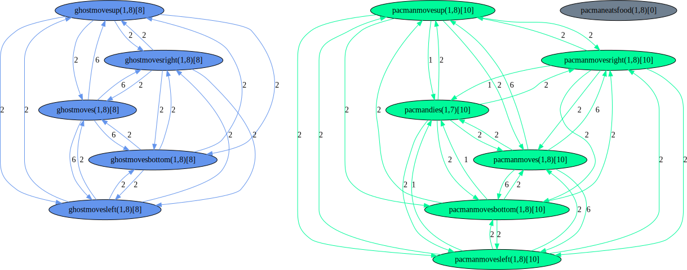
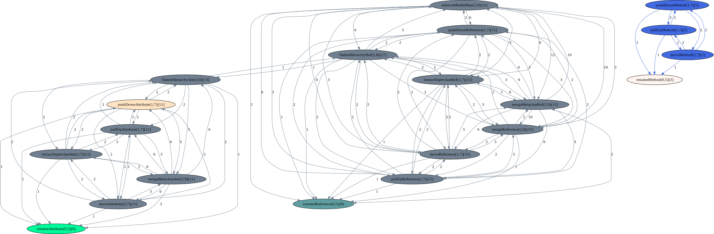

# Supplements

## Section 6.3.1 Experimental setting

### Conflict graph for the Pac-Man case

  

### Conflict graph for the MM-Refactoring case

  

## List of all the rules related to the MM-Refactoring case

<ul>
	<li> Rename Attribute. Attribute name changes</li>
	<li> Rename Method. Method name changes</li>
	<li> Rename Reference. Reference name changes</li>
	<li> Merge Reference. References of a class merge as a reference with a type to another class.</li>
	<li> Move Attribute. Attribute moves from one class to another class.</li>
	<li> Move Method. Method of a class moves to another class</li>
	<li> Flatten Hierarchy Attribute. The supertype has been removed and the attributes of the supertype have been duplicated in each subclass.</li>
	<li> pull-up Method. A method in subclass after refactoring pulls up to superclass.</li>
	<li> Flatten Hierarchy Reference. The supertype has been removed and the reference of the supertype has been duplicated in each subclass.</li>
	<li> Pull-up Attribute. Attribute in subclass after refactoring pulls up to superclass.</li>
	<li> Push-down Method. A method in superclass after refactoring pushes down to subclass.</li>
	<li> Push-down Attribute. Attribute in superclass after refactoring pushes down to subclass.</li>
	<li> Push-down Reference. Reference in superclass after refactoring pushes down to subclass.</li>
	<li> Extract Superclass Attribute. A new superclass has been created with the attribute A property that was initially in a subclass.</li>
	<li> Move Reference. Reference moves from one class to another class.</li>
	<li> Merge Meta-class Attribute. After merging two classes that were inherited from a shared superclass, the attributes connected to subclasses were saved into the new merged class.</li>
	<li> Pull-up Reference. Reference in subclass after refactoring pulls up to superclass.</li>
	<li> Merge Meta-class Reference. After merging two classes that were inherited from a shared superclass, the references connected to subclasses were saved into the new merged class.</li>
	<li> Remove Middle-man. Delete the middle access methods and force the client to call the end methods directly.</li>
</ul>

  ## The list of all the orders for both the Pac-Man and the MM-Refactoring cases

  ### The list of order for the Pac-Man case
  
<ul>
	<li> <b> Ordered </b>        
		<ul>
			<li> 1. "ghost moves down", "pacman eats food", "pacman moves right"</li>
			<li> 2. "ghost moves up", "pacman moves left"</li>
			<li> 3. "ghost moves left", "pacman moves down"</li>
			<li> 4. "ghost moves right", "pacman moves up"</li>
			<li> 5. "ghost moves", "pacman dies"</li>
			<li> 6. "pacman moves"</li>
		</ul>
	</li>
	<li> <b> Reverse order </b>       
		<ul>
			<li> 6. "pacman moves"</li>
			<li> 5. "ghost moves", "pacman dies"</li>
			<li> 4. "ghost moves right", "pacman moves up"</li>
			<li> 3. "ghost moves left", "pacman moves down"</li>
			<li> 2. "ghost moves up", "pacman moves left"</li>
			<li> 1. "ghost moves down", "pacman eats food", "pacman moves right"</li>
		</ul>
	</li>
	<li> <b> Random 1 </b>        
		<ul>
			<li> 5. "ghost moves", "pacman dies"</li>
			<li> 4. "ghost moves right", "pacman moves up"</li>
			<li> 6. "pacman moves"</li>
			<li> 2. "ghost moves up", "pacman moves left"</li>
			<li> 1. "ghost moves down", "pacman eats food", "pacman moves right"</li>
			<li> 3. "ghost moves left", "pacman moves down"</li>
		</ul>
	</li>
	<li> <b> Random 2 </b>        
		<ul>
			<li> 4. "ghost moves right", "pacman moves up"</li>
			<li> 6. "pacman moves"</li>
			<li> 1. "ghost moves down", "pacman eats food", "pacman moves right"</li>
			<li> 5. "ghost moves", "pacman dies"</li>
			<li> 3. "ghost moves left", "pacman moves down"</li>
			<li> 2. "ghost moves up", "pacman moves left"</li>
		</ul>
	</li>
	<li> <b> Random 3 </b>       
		<ul>
			<li> 2. "ghost moves up", "pacman moves left"</li>
			<li> 3. "ghost moves left", "pacman moves down"</li>
			<li> 5. "ghost moves", "pacman dies"</li>
			<li> 1. "ghost moves down", "pacman eats food", "pacman moves right"</li>
			<li> 6. "pacman moves"</li>
			<li> 4. "ghost moves right", "pacman moves up"</li>
		</ul>
	</li>
	<li> <b> Random 4 </b>   
		<ul>
			<li> 3. "ghost moves left", "pacman moves down"</li>
			<li> 1. "ghost moves down", "pacman eats food", "pacman moves right"</li>
			<li> 2. "ghost moves up", "pacman moves left"</li>
			<li> 6. "pacman moves"</li>
			<li> 4. "ghost moves right", "pacman moves up"</li>
			<li> 5. "ghost moves", "pacman dies"</li>
		</ul>
	</li>
</ul>

 ## The list of order for the MM-Refactoring case
  
<ul>
	<li> <b> Ordered </b>       
		<ul>
			<li> 1. "Rename Attribute", "Rename Method", "Rename Reference"</li>
			<li> 2. "Merge Reference", "Move Attribute", "Move Method" 	</li>
			<li> 3. "Flatten Hierarchy Attribute", "Extract Superclass Reference", "Pull-up Method"</li>
			<li> 4. "Flatten Hierarchy Reference", "Pull-up Attribute", "Push-down Method"</li>
			<li> 5. "Push-down Attribute", "Push-down Reference" </li>
			<li> 6. "Extract Superclass Attribute", "Move Reference"	</li>
			<li> 7. "Merge Meta-class Attribute", "Pull-up Reference"	</li>
			<li> 8. "Merge Meta-class Reference" 	</li>
			<li> 9. "Remove Middle-man"	</li>
		</ul>
	</li>
	<li> <b> Reverse order </b>       
		<ul>
			<li> 9. "Remove Middle-man"</li>
			<li> 8. "Merge Meta-class Reference"</li>
			<li> 7. "Merge Meta-class Attribute", "Pull-up Reference"</li>
			<li> 6. "Extract Superclass Attribute", "Move Reference"	</li>
			<li> 5. "Push-down Attribute", "Push-down Reference" </li>
			<li> 4. "Flatten Hierarchy Reference", "Pull-up Attribute", "Push-down Method"</li>
			<li> 3. "Flatten Hierarchy Attribute", "Extract Superclass Reference", "Pull-up Method"</li>
			<li> 2. "Merge Reference", "Move Attribute", "Move Method" 	</li>
			<li> 1. "Rename Attribute", "Rename Method", "Rename Reference"</li>
		</ul>
	</li>
	<li> <b> Random 1 </b>        
		<ul>
			<li> 4. "Flatten Hierarchy Reference", "Pull-up Attribute", "Push-down Method"</li>
			<li> 5. "Push-down Attribute", "Push-down Reference" </li>
			<li> 6. "Extract Superclass Attribute", "Move Reference"	</li>
			<li> 1. "Rename Attribute", "Rename Method", "Rename Reference"</li>
			<li> 9. "Remove Middle-man"</li>
			<li> 3. "Flatten Hierarchy Attribute", "Extract Superclass Reference", "Pull-up Method"</li>
			<li> 8. "Merge Meta-class Reference" 	</li>
			<li> 7. "Merge Meta-class Attribute", "Pull-up Reference"	</li>
			<li> 2. "Merge Reference", "Move Attribute", "Move Method" </li>
		</ul>
	</li>
	<li> <b> Random 2 </b>        
		<ul>
			<li> 5. "Push-down Attribute", "Push-down Reference"</li>
			<li> 3. "Flatten Hierarchy Attribute", "Extract Superclass Reference", "Pull-up Method"</li>
			<li> 9. "Remove Middle-man"   </li>
			<li> 8. "Merge Meta-class Reference"</li>
			<li> 1. "Rename Attribute", "Rename Method", "Rename Reference"</li>
			<li> 7. "Merge Meta-class Attribute", "Pull-up Reference"	</li>
			<li> 2. "Merge Reference", "Move Attribute", "Move Method" 	</li>
			<li> 4. "Flatten Hierarchy Reference", "Pull-up Attribute", "Push-down Method"</li>
			<li> 6. "Extract Superclass Attribute", "Move Reference"	</li>
		</ul>
		<li> <b> Random 3 </b>       
			<ul>
				<li> 7. "Merge Meta-class Attribute", "Pull-up Reference"</li>
				<li> 1. "Rename Attribute", "Rename Method", "Rename Reference"</li>
				<li> 8. "Merge Meta-class Reference"</li>
				<li> 2. "Merge Reference", "Move Attribute", "Move Method" 	</li>
				<li> 3. "Flatten Hierarchy Attribute", "Extract Superclass Reference", "Pull-up Method"</li>
				<li> 5. "Push-down Attribute", "Push-down Reference" </li>
				<li> 9. "Remove Middle-man"</li>
				<li> 6. "Extract Superclass Attribute", "Move Reference"</li>
				<li> 4. "Flatten Hierarchy Reference", "Pull-up Attribute", "Push-down Method"</li>
			</ul>
		</li>
		<li> <b> Random 4 </b>        
			<ul>
				<li> 8. "Merge Meta-class Reference" 	</li>
				<li> 4. "Flatten Hierarchy Reference", "Pull-up Attribute", "Push-down Method"</li>
				<li> 1. "Rename Attribute", "Rename Method", "Rename Reference"</li>
				<li> 9. "Remove Middle-man"</li>
				<li> 7. "Merge Meta-class Attribute", "Pull-up Reference"</li>
				<li> 2. "Merge Reference", "Move Attribute", "Move Method" </li>
				<li> 6. "Extract Superclass Attribute", "Move Reference"	</li>
				<li> 5. "Push-down Attribute", "Push-down Reference" 	</li>
				<li> 3. "Flatten Hierarchy Attribute", "Extract Superclass Reference", "Pull-up Method"</li>
			</ul>
		</li>
		<li> <b> Random 5 </b>   
			<ul>
				<li> 6. "Extract Superclass Attribute", "Move Reference"</li>
				<li> 9. "Remove Middle-man"</li>
				<li> 2. "Merge Reference", "Move Attribute", "Move Method" </li>
				<li> 7. "Merge Meta-class Attribute", "Pull-up Reference"	</li>
				<li> 8. "Merge Meta-class Reference"</li>
				<li> 1. "Rename Attribute", "Rename Method", "Rename Reference"</li>
				<li> 4. "Flatten Hierarchy Reference", "Pull-up Attribute", "Push-down Method"</li>
				<li> 3. "Flatten Hierarchy Attribute", "Extract Superclass Reference", "Pull-up Method"</li>
				<li> 5. "Push-down Attribute", "Push-down Reference" </li>
			</ul>
		</li>
		<li> <b> Random 6 </b>        
			<ul>
				<li> 3. "Flatten Hierarchy Attribute", "Extract Superclass Reference", "Pull-up Method"</li>
				<li> 6. "Extract Superclass Attribute", "Move Reference"</li>
				<li> 4. "Flatten Hierarchy Reference", "Pull-up Attribute", "Push-down Method"	</li>
				<li> 5. "Push-down Attribute", "Push-down Reference" 	</li>
				<li> 2. "Merge Reference", "Move Attribute", "Move Method" 	</li>
				<li> 8. "Merge Meta-class Reference" 	</li>
				<li> 1. "Rename Attribute", "Rename Method", "Rename Reference"</li>
				<li> 9. "Remove Middle-man"</li>
				<li> 7. "Merge Meta-class Attribute", "Pull-up Reference"</li>
			</ul>
		</li>
		<li> <b> Random 7 </b>   
			<ul>
				<li> 2. "Merge Reference", "Move Attribute", "Move Method"</li>
				<li> 7. "Merge Meta-class Attribute", "Pull-up Reference"	</li>
				<li> 6. "Extract Superclass Attribute", "Move Reference"	</li>
				<li> 3. "Flatten Hierarchy Attribute", "Extract Superclass Reference", "Pull-up Method"</li>
				<li> 4. "Flatten Hierarchy Reference", "Pull-up Attribute", "Push-down Method"</li>
				<li> 9. "Remove Middle-man"  </li>
				<li> 5. "Push-down Attribute", "Push-down Reference" </li>
				<li> 1. "Rename Attribute", "Rename Method", "Rename Reference"</li>
				<li> 8. "Merge Meta-class Reference" 	</li>
			</ul>
		</li>
	</ul>